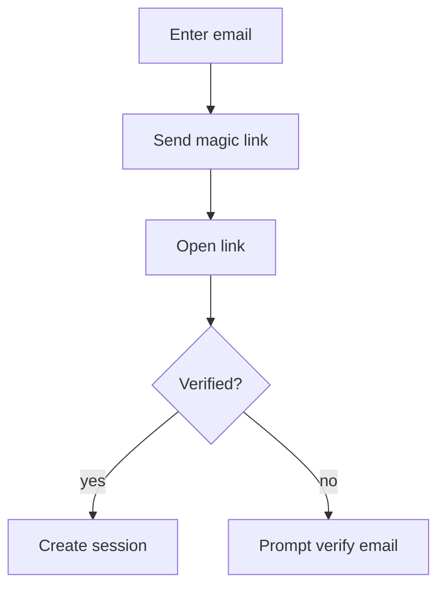

# Flows & IA (Skeleton)

Capture key user journeys, information architecture, and state transitions.

Use Mermaid for sequence/flow diagrams where helpful:

Link flow steps to relevant patterns and components.
